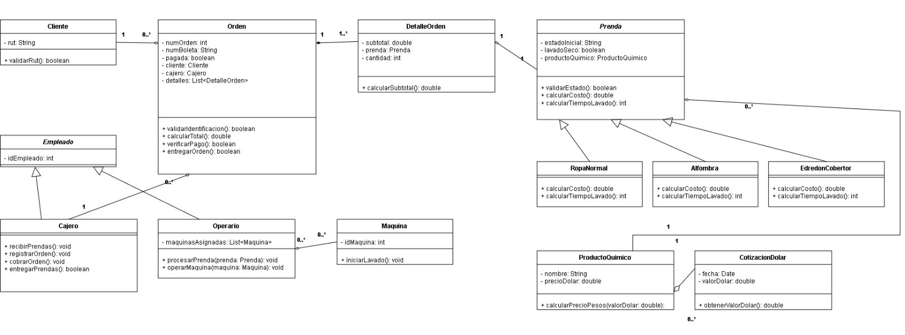
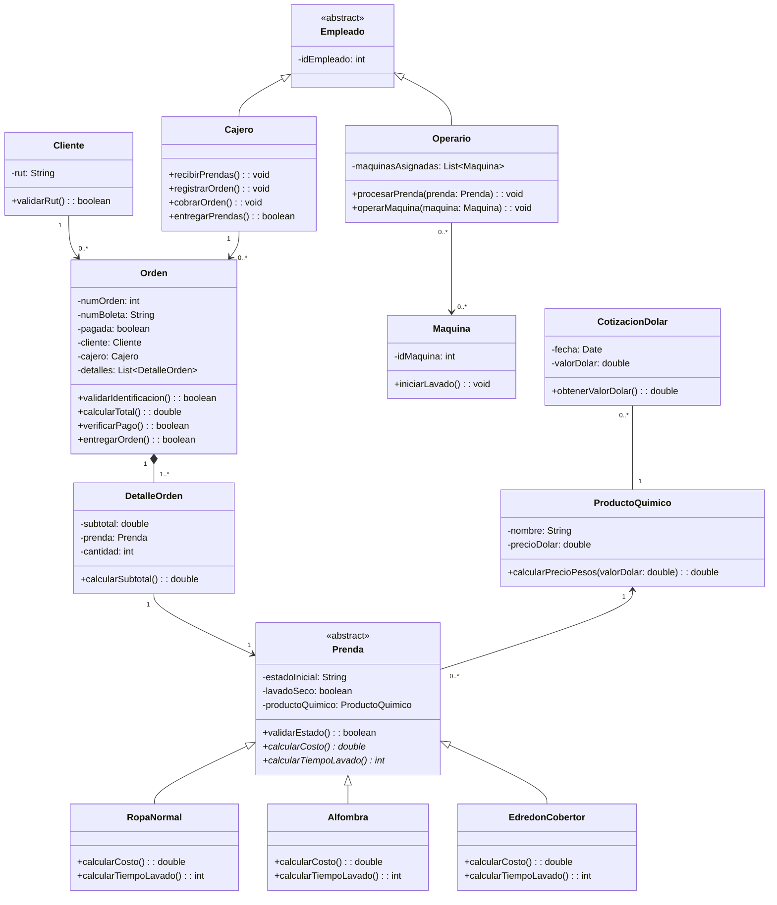

# Sistema de Lavandería y Tintorería

Repositorio para la asignatura de Programación Orientada a Objetos Seguro.

**Profesor:** Michael Arjel  
**Institución:** Inacap  
**Alumno:** panxoslaras-gthub  

---

## Descripción del Proyecto

Sistema modular orientado a objetos para la gestión integral de un negocio de **Lavandería y Tintorería**, implementado según el diagrama de clases UML oficial (`diagrama.jpeg`).

El sistema aplica principios de:
* **Encapsulamiento estricto:** Atributos privados (`__atributo`), validación rigurosa mediante setters y propiedades `@property`.
* **Herencia y Polimorfismo:** Jerarquías de clases para empleados (`Empleado` -> `Cajero`, `Operario`) y prendas (`Prenda` -> `RopaNormal`, `Alfombra`, `EdredonCobertor`), con cálculo dinámico de costos y tiempos de ciclo.
* **Separación de Responsabilidades (Capa DAO):** Capa de acceso a datos relacional SQLite (`lavanderia.db`) que abstrae las operaciones de persistencia mediante herencia de `DAO`.
* **Manejo de Moneda Extranjera:** Conversión de insumos químicos en dólares (USD) a pesos chilenos (CLP) en base a `CotizacionDolar`.

---

## Diagrama de Clases





---

## Estructura del Repositorio

```text
lavanderia_114_2A_f2/
│
├── conectar.py               # Gestión de conexión SQLite (lavanderia.db) con PRAGMA foreign_keys
├── main.py                   # Script de integración, generación de tablas y pruebas de dominio
├── README.md                 # Documentación técnica del sistema
├── .gitignore                # Archivos omitidos (pycache, compilados)
├── diagrama.jpeg             # Diagrama de clases de referencia
│
├── dao/                      # Capa de Acceso a Datos (Data Access Object)
│   ├── __init__.py
│   ├── dao.py                # Clase base DAO
│   ├── cliente_dao.py
│   ├── empleado_dao.py
│   ├── cajero_dao.py
│   ├── operario_dao.py
│   ├── maquina_dao.py
│   ├── producto_quimico_dao.py
│   ├── cotizacion_dolar_dao.py
│   ├── prenda_dao.py
│   ├── ropa_normal_dao.py
│   ├── alfombra_dao.py
│   ├── edredon_cobertor_dao.py
│   ├── orden_dao.py
│   └── detalle_orden_dao.py
│
└── model/                    # Capa de Dominio (Modelos POO)
    ├── __init__.py
    ├── cliente.py
    ├── empleado.py           # Clase abstracta base
    ├── cajero.py
    ├── operario.py
    ├── maquina.py
    ├── cotizacion_dolar.py
    ├── producto_quimico.py
    ├── prenda.py             # Clase abstracta base
    ├── ropa_normal.py
    ├── alfombra.py
    ├── edredon_cobertor.py
    ├── detalle_orden.py
    └── orden.py
```

---

## Bitácora de Avances

### 28 de Septiembre de 2026
- **Configuración del Proyecto:** Creación de la arquitectura base del proyecto adaptada al dominio de Lavandería y Tintorería.
- **Implementación del Modelo de Dominio (`model/`):**
  - Implementación de las 13 entidades descritas en `diagrama.jpeg`.
  - Abstracción de `Empleado` y `Prenda` mediante `abc.ABC`.
  - Encapsulamiento con validación de tipos, RUT chileno, cantidades positivas y estados válidos.
  - Sobrescritura de métodos polimórficos `calcular_costo()` y `calcular_tiempo_lavado()`.
- **Implementación de la Capa DAO (`dao/`):**
  - Creación de la clase base `DAO` y especializaciones para cada entidad del modelo relacional.
  - Generación automática de tablas relacionales con claves foráneas activas (`PRAGMA foreign_keys = ON`).
- **Script Principal (`main.py`):**
  - Integración completa: inicialización de base de datos, cálculo de cotización USD a CLP, asignación de maquinaria, procesamiento de órdenes, validaciones y entrega.
